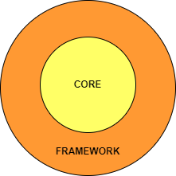

# BMI - API
### Example application for a minimal clean architecture use case based design.

### Calculates the Body Mass Index for a previous saved User.

### Layers:

- CORE: Contains the bussines logic, use cases, domains.
- FRAMEWORK: Any java framework, in ths cases, Spring Boot.

###Requires:
- Java 14+
- Maven 3+

###Stack:
- Spring boot 2.5.6
- H2 database
- Beam Validations API
- Spring Fox Swagger UI

###Compile & Run:
1. Clone the repo
2. From command line run:
>>mvn clean install
3. From command line Run: 
>>mvn spring-boot:run
4. Or import in your IDE and run from it.
5. Open in your browse: http://localhost:8080/swagger-ui.html

###Usage:
1. Use the **'/users'** endpoint to create a new user, the application will save it in the H2 memory database.
2. Use the **'/bmi'** endpoint to calculates the BMI for an user.